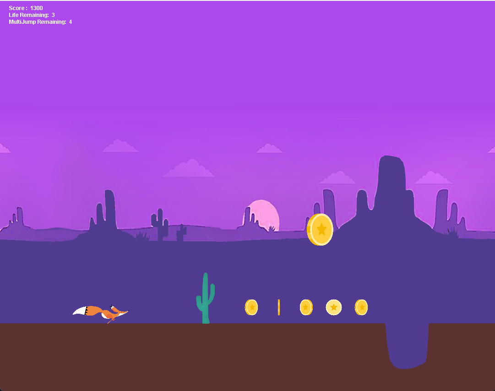

## RUN FOX RUN

Final project for my Unix Class, a Java written Parkour Game. 

## version

My JDK is corretto-1.8 to be compatible with Lombok

## Game Setting

This is about a fox running.
The little fox avoids obstacles and pits on the ground by jumping and collects coins to increase its score. Colliding with obstacles will decrease its life, but I have exempted its tail from this rule. You have 5 chances for a double jump. Try to see how far you can run!

## start running

Game.java is the entrance.
